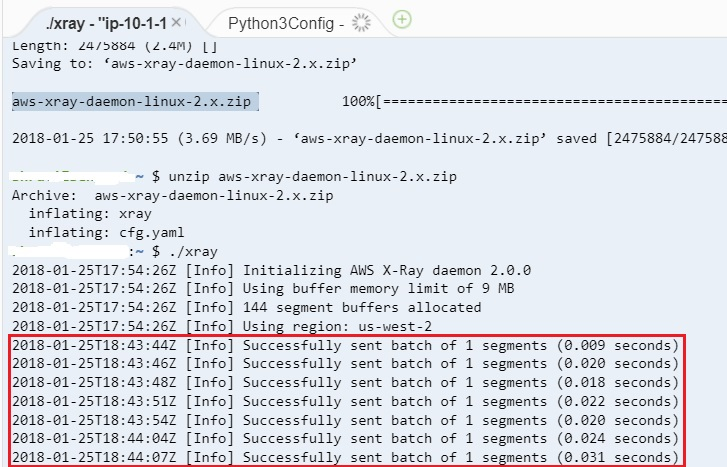
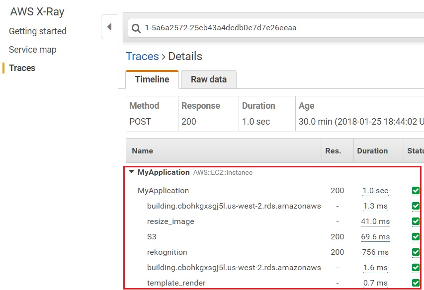

## AWS X-Ray

Here, you will analyze and collect diagnostics information related to your application with AWS X-Ray. With AWS X-Ray, you can understand how your application and its underlying services are performing to identify and troubleshoot the root cause of performance issues. AWS X-Ray traces user requests as they travel through your entire application. It then aggregates the data generated by the individual services and resources that make up your application, providing you with a trace map of how your application is performing.
Note: Make sure to sign in to your AWS account with the AWS IAM user edXProjectUser credentials.

To begin, follow the steps below.
1. Start the RDS database instance

-    In the AWS Console, click Services, then click Relational Database Service to open the Amazon RDS dashboard.
-    In the left navigation pane, click Instances. From the list of instances, select edx-photos-db.
-    At the top, click Instance actions, and then click Start.

2. Download and explore the exercise code.

-    Type the command below in your AWS Cloud9 terminal to make sure you are in the ~/environment directory of your AWS Cloud9 instance.
```
    cd ~/environment
```
-    In your AWS Cloud9 environment, download the exercise code by typing the command below in the terminal.
```
    wget https://us-west-2-tcdev.s3.amazonaws.com/courses/AWS-100-ADG/v1.1.0/exercises/ex-xray.zip
```
-    Unzip the exercise code .zip file by typing the command below in your AWS Cloud9 terminal.
```
    unzip ex-xray.zip
```
-    The contents of the .zip file should be extracted to a folder with a similar name. You can view the folder on the left tree view.
-    Open the exercise-xray/FlaskApp/application.py file and explore the code. Notice that the AWS X-Ray libraries, such as aws_xray_sdk.core, xray_recorder, and XRayMiddleware, are now being imported in the application.py file. AWS X-Ray is configured with XRayMiddleware to gather tracing information for different services and report the information back into the AWS cloud.
-    Open the exercise-xray/util.py file. Notice that there is a @xray_recorder.capture() decorator, which captures the time needed to resize the uploaded photo to a desired size. This information is reported back to the AWS cloud.

3. Download and run the AWS X-Ray daemon on your AWS Cloud9 instance.

-    Go to the AWS X-Ray daemon documentation link below: https://docs.aws.amazon.com/xray/latest/devguide/xray-daemon.html
-    On the documentation page, scroll down until you see a link to Linux (executable)-aws-xray-daemon-linux-2.x.zip (sig). Right-click the link and copy the link address.
-    In your AWS Cloud9 instance terminal, type the command below to go to your home directory.
```
    cd ~
```
-    Type wget and paste the AWS X-Ray daemon hyperlink address that you copied. The command should look like the example below.
```
    wget https://s3.dualstack.us-east-2.amazonaws.com/aws-xray-assets.us-east-2/xray-daemon/aws-xray-daemon-linux-2.x.zip
```
-    Unzip the AWS X-Ray daemon by typing the command below. Make sure that the name of the .zip file matches the one in the command below.
```
    unzip aws-xray-daemon-linux-2.x.zip
```
-    Run the AWS X-Ray daemon by typing the command below.
```
    ./xray
```
4. Run the exercise code and test the application.

-    To run the exercise code, you will need to point the Run Configuration to the correct exercise folder. In the Python3RunConfiguration pane at the bottom, in the Command text box, type the text shown below and then click Run.

    exercise-xray/FlaskApp/application.py

-    A message like the one below should appear.

    Running on http://0.0.0.0:8080/
-    To test the application, click Preview -> Preview Running Application on the top menu bar of the Cloud9 environment.
-    Pop out the application in a new window by clicking the Pop Out button.
-    Log in to the application with your credentials, and upload a photo. Click My photos at the top-right corner of the application. You should see your uploaded photo.
-    Go to your AWS Cloud9 instance terminal and notice that the AWS X-Ray daemon is sending diagnostics information to your AWS account. You should see information as shown in the screenshot below.

5. Explore the diagnostics information collected by AWS X-Ray.

-    In the AWS Console, click Services, then click X-Ray to open the AWS X-Ray dashboard.
-    If you are using AWS X-Ray for the first time, you may have to click Get Started and then click Cancel to exit the wizard.
-    Click Service map in the left navigation menu. The service map has information about AWS services communicating with each other and the processing time each service needs.
-    On the left side, click Traces. You should see response times and time taken by each component in the application.
-    In the Trace list at the bottom, click the trace item where the Method column contains POST. You should see timing information for all the calls made in your application, as shown in the screenshot below. This particular trace information should be about the POST made to the application to upload a photo. Notice the time needed for Amazon S3, Amazon RDS and Amazon Rekognition to process the photo. You can also see the time needed to resize the image against the resize_image label.

-   With this diagnostics information, you can now find out which component in your application is taking longer to process.


