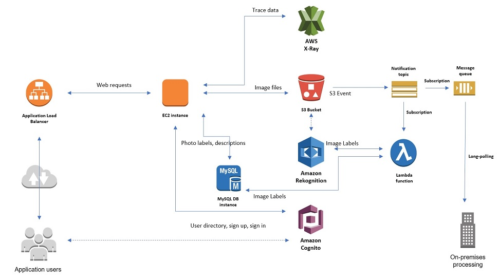
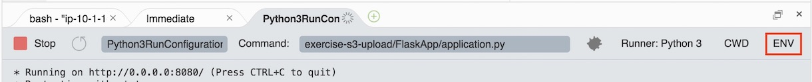

## Building a ML end-point Application using Amazon Rekognition

Here, you will create your first AWS Cloud9 environment and start building the first component of the course project. AWS Cloud9 is a cloud-based IDE that lets you write, run, and debug your code with just a browser.
Note: Make sure to sign in to your AWS account with the AWS IAM user edXProjectUser credentials.




The diagram shown above is the architecture diagram for the application you will build over the duration of the course. The course project is a simple web application in which users log in to their accounts and upload photos to an Amazon S3 bucket, process the photos with Amazon Rekognition to generate labels and then store the photos along with their labels and description in an Amazon RDS database.

The application is deployed on an Amazon EC2 instance with an Application Load Balancer sitting in front of the instance to direct user requests to the instance. Amazon Cognito is used to sign up/sign in users for the application. In order to asynchronously process the photo labels, when a photo is uploaded, an Amazon S3 bucket event notification is issued to an Amazon SNS topic. This triggers a subscribed AWS Lambda function, which talks to Amazon Rekognition. To make the application more distributed, an Amazon SQS queue subscribed to the Amazon SNS topic stores all the incoming requests and an on-premises application polls the queue for processing. AWS X-Ray traces the calls made to all the AWS resources in this application, thereby providing diagnostics information. The application is coded in Python 3 using AWS Cloud9 as the IDE.

In this exercise, you will build the Amazon S3 uploader component of the application. In this component, users will upload a photo to an Amazon S3 bucket.

To begin, follow the instructions below.
1. Create AWS Cloud9 environment and explore the environment.

In this section, you will create an AWS Cloud9 environment and explore the environment.

-    In the AWS Console, click Services, then click Cloud9 to open the Cloud9 dashboard.
-    Make sure you are in the Oregon region.
-    Click Create environment at the top-right corner.
-    For Name, type BuildingOnAWS
-    Click Next step.
-    On the Configure settings page, leave the default selection in the Environment settings section and scroll down to Network settings (advanced).
-    For Network (VPC), choose the edx-build-aws-vpc id you wrote down in the third exercise.
-    For Subnet, choose the public subnet in edx-build-aws-vpc with the subnet-id you noted in the third exercise.
-    Click Next step.
-    Review the details and click Create environment. This should launch your AWS Cloud9 environment in a few minutes.
-    Upon environment creation, notice the terminal window on the bottom pane. The terminal provides a remote login to the instance on which the AWS Cloud9 environment is hosted, just as you used SSH for remote login in the third exercise. A pre-authenticated AWS CLI is installed in your terminal.
-    Explore the terminal by typing this command:
```
    aws ec2 describe-instances
```

    This should give a JSON output with the all the information of the EC2 instances in your account.
    Install Boto 3 on your AWS Cloud9 instance by typing this command:
```
    sudo pip-3.6 install boto3
```

    At the terminal, type python3 and press ENTER.
    Explore the Python Boto 3 APIs by executing these commands:
```
    import boto3
    client = boto3.client('ec2')
    client.describe_instances()
```
    Press CTRL+D to exit the Python interpreter.

2. Create an Amazon S3 bucket to store the application photos.

In this section, you will create an Amazon S3 bucket in your AWS account. This bucket will store your application photos. If you are familiar with Amazon S3, you may want to attempt to complete this section by using the properties below before reading the step-by-step instructions.

Region: Oregon (us-west-2)
Bucket name: Type a unique bucket name to store photos and make a note of it for later use.

Expand for step-by-step instructions

-    In the AWS Console, click Services, then click S3 to open the S3 dashboard.
-    Click Create bucket.
-    For Bucket name, type a unique bucket name to store photos. Write down the name of the bucket for later use.
-    For Region, make sure you have selected the Oregon (us-west-2) region.
-    Click Create.

3. Build the Amazon S3 uploader component of the application in the AWS Cloud9 environment.

In this section, you will build the Amazon S3 uploader component of the application. The Amazon S3 uploader component uploads photos to the Amazon S3 bucket you created in the previous section.

-    Type the command below in your AWS Cloud9 terminal to make sure you are in the ~/environment directory of your AWS Cloud9 instance.
```
    cd ~/environment
```
    Type the command below in your AWS Cloud9 terminal to download the Python code for the Amazon S3 uploader component.
```
    wget https://us-west-2-tcdev.s3.amazonaws.com/courses/AWS-100-ADG/v1.1.0/exercises/ex-s3-upload.zip
```
-    On the left tree view, you should see the exercise code .zip file named ex-s3-upload.zip.
-    Unzip the exercise code .zip file by typing the command below in your AWS Cloud9 terminal.
```
    unzip ex-s3-upload.zip
```
-    The contents of the .zip file should be extracted to a folder with a similar name. You can view the folder on the left tree view.
-    Open the exercise-s3-upload/FlaskApp/application.py file and review the code. Notice that an Amazon S3 client has been created to interact with Amazon S3 via the Boto 3 API.
-    Install the requirements for the project by executing the command below in your AWS Cloud9 terminal.
```
    sudo pip-3.6 install -r exercise-s3-upload/FlaskApp/requirements.txt
```
-    To run the application.py code:
    - Select exercise-s3-upload/FlaskApp/application.py in the tree view.
    - On the top menu bar, click Run -> Run With -> Python 3.
    - You should see an error message asking for an environment variable named PHOTOS_BUCKET.
    - To successfully run the code, you will need to set environment variables. To do so, follow the instructions below:
    - On the right side of the Run Configuration pane at the bottom, click ENV, as in the screenshot below.
    
    - In the Name column, type PHOTOS_BUCKET
    - In the Value column, type the name of the Amazon S3 bucket you created earlier.
    - Note: Make sure to delete any white space that was inserted while copy/pasting.
    - In the Name column, type FLASK_SECRET
    - The Flask app uses a secret value to encrypt session variables.
    - In the Value column, type random characters and numbers.
    - Save the run configuration by typing a name for the configuration. This saves the run configuration with all the environment variables and the runner information. In the text box next to the Run button, type Python3RunConfiguration, as shown in the screenshot below.
    -    Run application.py again. This time, it should run successfully. In the terminal, you will see a message like this: cRunning on http://0.0.0.0:8080/ That means the Python Flask app is now running on port 8080 of the AWS Cloud9 instance.
    - To test the application, click Preview -> Preview Running Application on the top menu bar of the AWS Cloud9 environment. Refer to the screenshot below.
    - You should see the application running in a small window in the AWS Cloud9 environment.
    - Pop out the application in a new window by clicking the Pop Out button shown in the screenshot below.
    - The application is now running in your local AWS Cloud9 environment.
    - Try uploading a few photos via the app. You will notice that the photos are stored in the Amazon S3 bucket that you created earlier.
    - Note: Your AWS Cloud9 instance has been configured to auto-hibernate your environment to prevent unnecessary charges.
